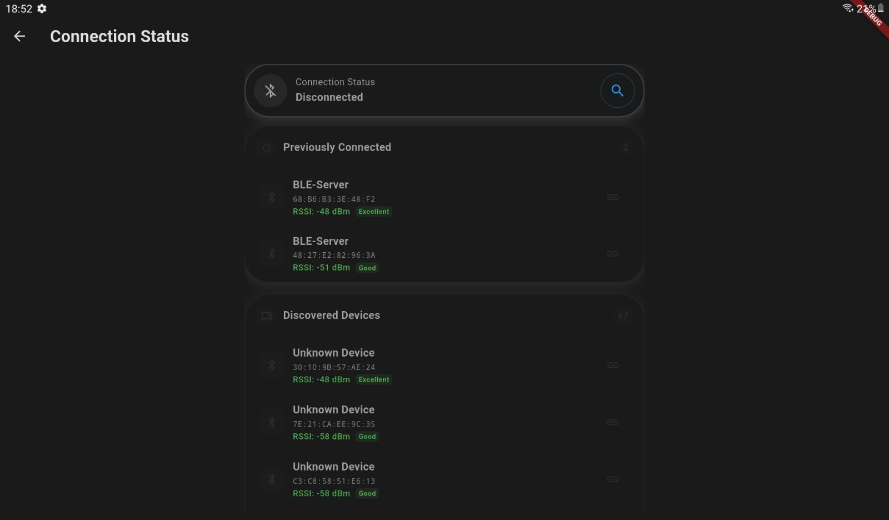
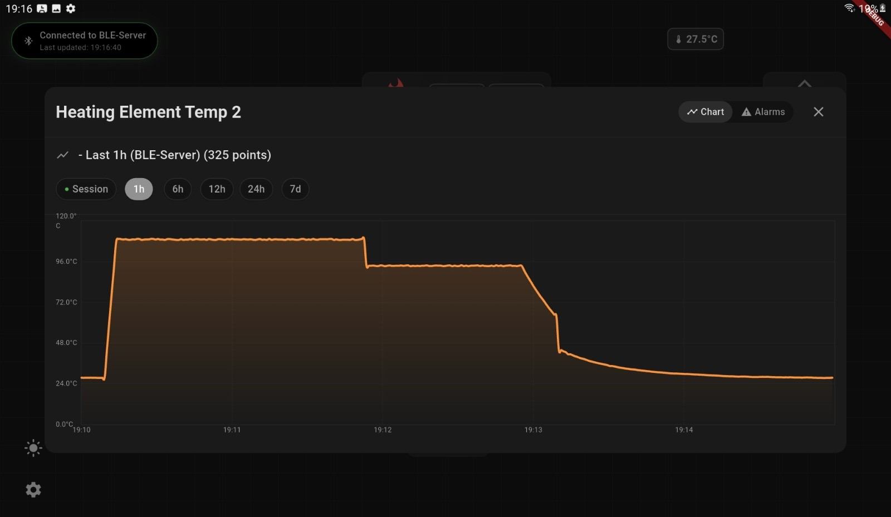

# Cooler Monitoring System Documentation

The Cooler Monitoring System is a full-stack IoT application designed for real-time monitoring and control of a heat exchange system. The project encompasses an embedded system built on an ESP32 microcontroller that communicates via Bluetooth Low Energy (BLE) with a cross-platform mobile application developed using Flutter.

The core functionality involves capturing sensor data from the heat exchange system, transmitting it wirelessly to the mobile app, visualizing the data in real-time, storing it for historical analysis, and providing a user interface for system control.

## Project Overview

*High-level system architecture.*

 

*The mobile application provides a clean interface for connection management and real-time data visualization.*

## System Architecture

The system is architecturally divided into four primary components that interact to provide the complete monitoring solution.

**Component Breakdown:**

- **Mobile App (Flutter):** The primary user interface. It handles BLE device discovery, connection, real-time data visualization, session management, alarm configuration, and user settings.
    
- **ESP32 Slave (BLE):** The embedded core of the system. It runs firmware that collects sensor data, processes it, and transmits it wirelessly via a BLE GATT server. It also receives control commands from the mobile app.
    
- **Master Controller:** An intermediary component that interfaces directly with the physical sensors via I2C and communicates with the ESP32 slave. It contains the low-level logic to control the hardware.
    
- **Physical Hardware:** The actual heat exchange system, comprising various sensors (temperature, level, flow rate), control elements (heaters, pumps), and the heat exchanger itself.
    

**Data Flow:**

The physical hardware's sensors are read by the Master Controller, which passes the data to the ESP32 Slave via I2C. The ESP32 then advertises this data over BLE. The Flutter Mobile App scans for and connects to the ESP32, subscribes to its data characteristic, and receives a real-time stream of sensor readings, which it then visualizes and stores.

## Detailed Documentation

For a deeper dive into the project's components, please refer to the following documents:

- **[Flutter Application](flutter-application.md):** A detailed guide to the mobile application, including its features, architecture, and code structure.
- **[ESP32 Firmware](esp32-firmware.md):** An in-depth look at the ESP32 firmware, covering the BLE services, data simulation, and communication protocols.
- **[Data Storage](data-storage.md):** An explanation of the session management and local data persistence system.
- **[Development Setup](development-setup.md):** Step-by-step instructions for setting up the development environment.

## Key Learnings & Challenges

This project provided a number of valuable learning experiences and technical challenges:

### Challenges

-   **BLE Communication Stability:** Ensuring a stable and reliable BLE connection, especially while handling real-time data streaming, was a significant challenge. Debugging connection drops and data parsing errors required a deep understanding of the BLE protocol and the `flutter_reactive_ble` library.
-   **Hardware-Software Integration:** The integration of the embedded firmware with the mobile application was a complex process. Debugging issues that spanned both the hardware and software required a holistic approach and the ability to analyze logs from both the ESP32 and the Flutter app simultaneously.
-   **Data Persistence and Synchronization:** Implementing a robust data persistence system that could handle a continuous stream of real-time data was a key challenge. Ensuring that data was stored efficiently and that the app could gracefully handle session resumption required careful design of the `SessionDataService` and the SQLite database schema.

### Key Learnings

-   **Full-Stack IoT Development:** This project provided hands-on experience in developing a complete, end-to-end IoT solution, from the low-level embedded firmware to the high-level mobile user interface.
-   **Advanced BLE Concepts:** Gained a deep understanding of BLE concepts, including GATT services, characteristics, and the nuances of managing BLE connections in a mobile environment.
-   **System Architecture Design:** Learned the importance of designing a decoupled and modular system. The separation of concerns between the data acquisition layer, the communication protocol, and the user interface made the system more scalable, testable, and maintainable.
-   **Real-time Data Handling:** Developed skills in handling and visualizing real-time data streams in a Flutter application, using `provider` for state management and `fl_chart` for creating responsive data visualizations.
-   **The Value of Simulation:** This project highlighted the critical importance of creating a realistic simulation for IoT projects. The simulated data service was invaluable for developing and testing the mobile application without requiring constant access to the physical hardware.