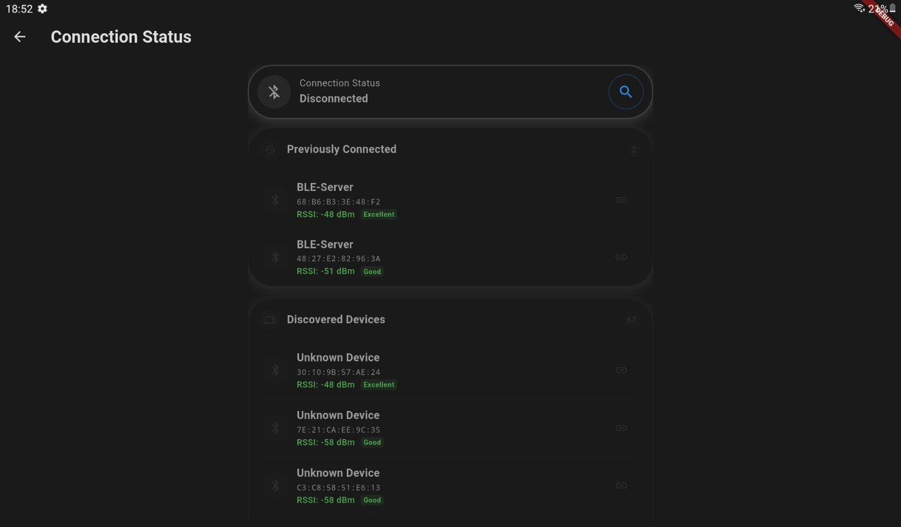
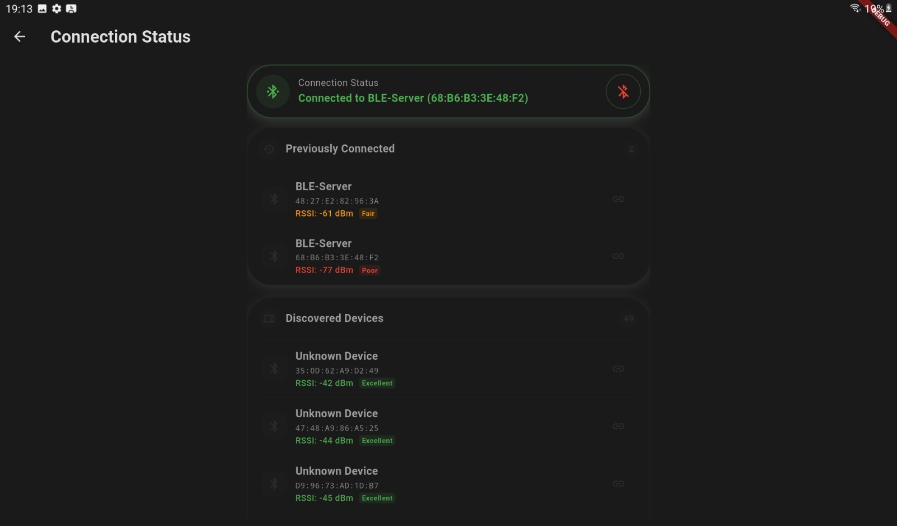
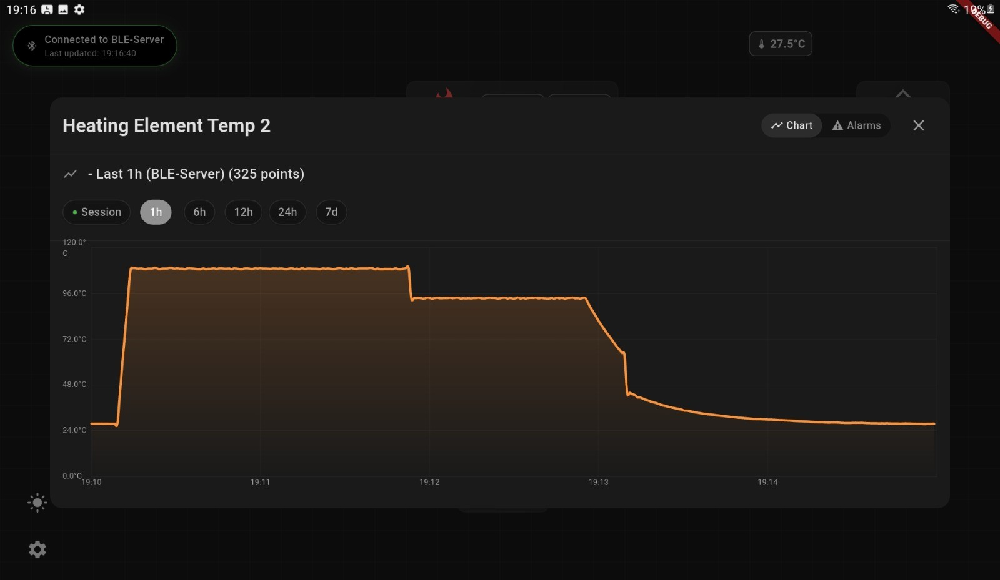
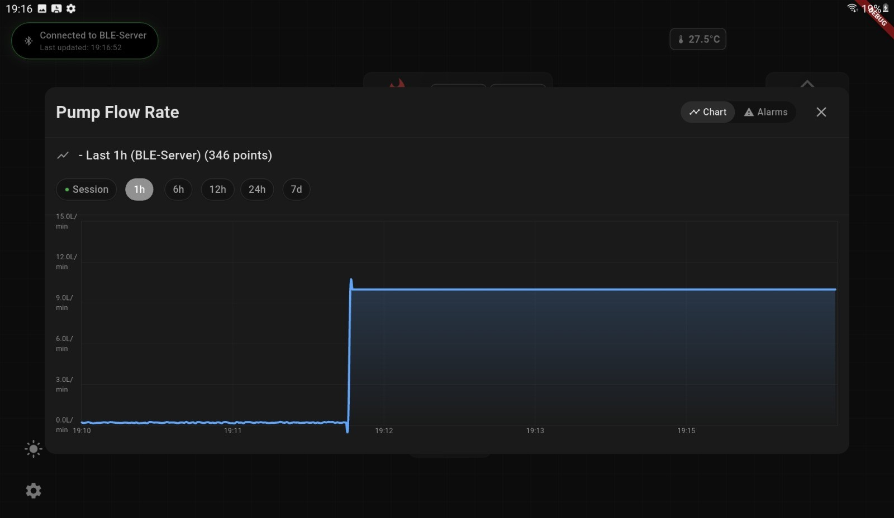
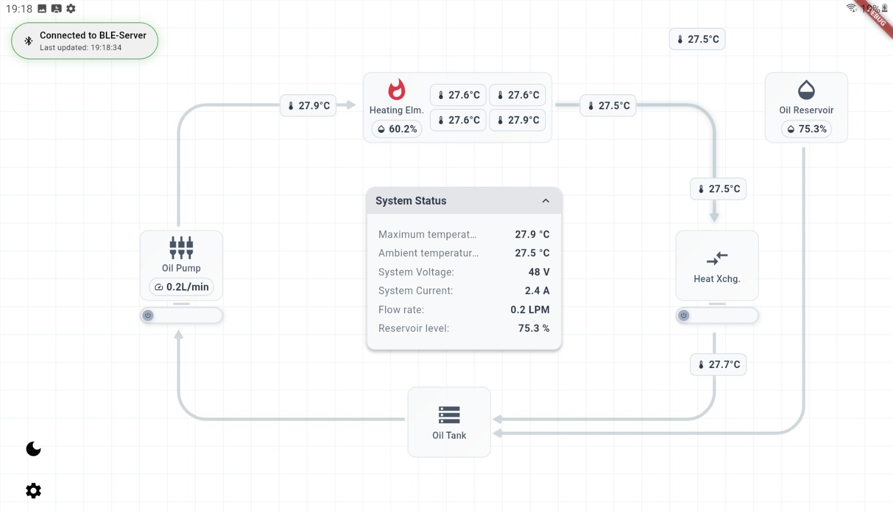
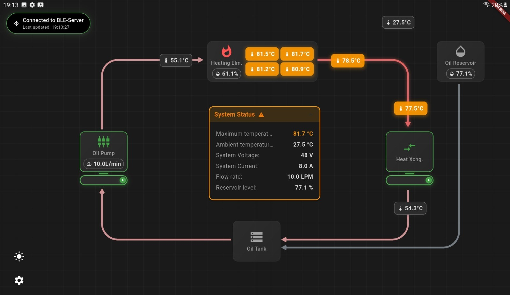
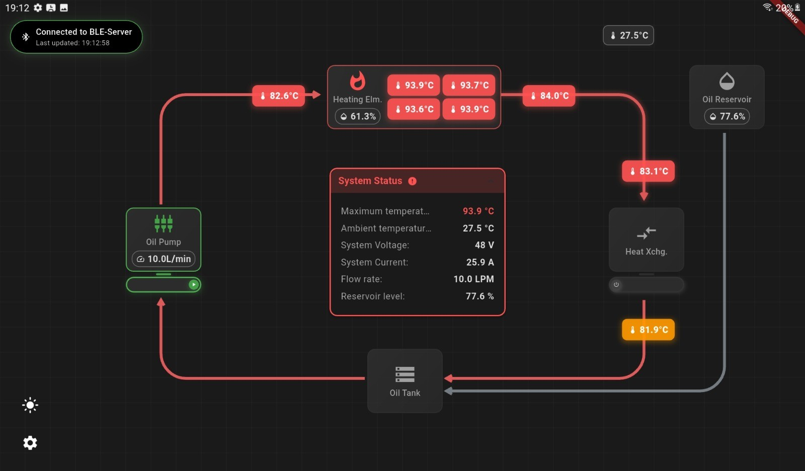

## Frontend: Flutter Mobile Application

The mobile application, built with Flutter, serves as the user's primary interface to the heat exchange system. It provides real-time data visualization, system control, and historical data analysis.

### Key Features:

- **Real-time Data Visualization:** Dynamically renders charts for 14 different sensor parameters, providing immediate insight into the system's operational status.
- **Seamless BLE Connectivity:** Manages the entire BLE lifecycle, including scanning for devices, connecting, handling notifications for data streaming, and managing disconnections gracefully.
- **Comprehensive Session Management:** Automatically captures and stores all sensor data received during a BLE connection into distinct "sessions." This allows for later review and analysis of historical performance.
- **Persistent Alarm System:** Allows users to configure and save threshold-based alarms for critical sensor values. The app provides alerts when these thresholds are breached.
- **Dual Theming:** Supports both light and dark modes for improved user experience and accessibility.
- **Simulated Data Mode:** Includes a mock data service that allows for full application testing and development without the need for physical hardware.

### Technologies & Libraries:

- **Framework:** Flutter
- **Language:** Dart
- **State Management:** `provider` for managing application state efficiently.
- **BLE Communication:** `flutter_reactive_ble` for robust and modern BLE interactions.
- **Charting:** `fl_chart` for creating beautiful and responsive data visualizations.
- **Local Storage:**
    - `sqflite`: For creating and managing a local SQLite database to store session data persistently.
    - `shared_preferences`: For storing simple key-value data like user settings and alarm thresholds.
- **Permissions:** `permission_handler` to manage required runtime permissions for Bluetooth and location on Android and iOS.
- **UI Assets:** `flutter_svg` for rendering scalable vector graphics.
- **Formatting:** `intl` for date and number formatting.

### Project Structure (`lib` directory):

- **`main.dart`:** Application entry point.
- **`models/`:** Defines the data structures for `SensorData`, `SessionData`, `BleDevice`, etc.
- **`screens/`:** Contains the UI for the main application views like the monitoring dashboard and settings page.
- **`services/`:** Encapsulates the core business logic.
- **`theme/`:** Defines the application's visual themes.
- **`widgets/`:** Contains reusable UI components like charts, sensor displays, and status panels.

### Data Models

The application's data models are defined in the `lib/models` directory:

- **`SensorData`**: Represents a single snapshot of sensor readings from the heat exchange system. It includes 14 sensor parameters, system status, and alert information.
- **`BleDevice`**: Represents a discovered BLE device, containing its ID, name, and RSSI (signal strength).
- **`BleStatus`**: An enum that defines the possible states of the BLE connection (`scanning`, `connecting`, `connected`, `disconnected`, `error`).
- **`SessionData`**: Represents a data collection session, including the session ID, device ID, start and end times, and the number of data points collected.
- **`OilProperties`**: A model for storing the physical properties of the oil, such as density, heat capacity, and viscosity.

### Application Screens

The UI is divided into three main screens, located in the `lib/screens` directory:

- **`MonitoringScreen`**: The main dashboard of the application. It displays a real-time, interactive diagram of the heat exchange system. System components like the pump, heater, and heat exchanger are represented by custom-painted widgets that update in real-time based on sensor data. This screen also provides controls for starting and stopping the system.
- **`SettingsScreen`**: A multi-panel screen that allows the user to configure various aspects of the application. It includes panels for general settings (like data retrieval frequency), oil properties, alarm indicator thresholds, and storage management.
- **`SystemStatusScreen`**: This screen is dedicated to managing the BLE connection. It shows the current connection status, lists available BLE devices, and allows the user to connect to or disconnect from a device.

### Core Services

The application's business logic is encapsulated in a set of services in the `lib/services` directory:

- **`BleScannerService`**: Responsible for scanning for nearby BLE devices. It uses the `flutter_reactive_ble` package to discover devices and provides a stream of `BleDevice` objects.
- **`BleSensorDataService`**: Manages the connection to a specific BLE device. It handles connecting, disconnecting, and reading sensor data from the device's characteristics. It also provides methods for sending control commands to the device and fetching historical data stored on the device's queue.
- **`SimulatedSensorDataService`**: A mock implementation of the `ISensorDataProvider` interface. It generates realistic sensor data using a physics-based thermal model, allowing for development and testing without a physical hardware connection.
- **`SessionDataService`**: Manages the lifecycle of data collection sessions. It automatically starts a new session upon a BLE connection and ends it on disconnection. It uses a `SessionStorageProvider` to persist session data.
- **`AlarmLimitsService`**: Manages the configuration of alarm thresholds for sensor values. It uses the `shared_preferences` package to persist the alarm limits.

### UI Widgets

The UI is built from a set of reusable widgets located in the `lib/widgets` directory:

- **`BaseComponent`**: A generic widget for displaying a component of the heat exchange system (e.g., pump, heater). It can display sensor values and an active state.
- **`SensorDisplay`**: A small, compact widget for displaying a single sensor value. It includes logic to change its background color based on the configured alarm thresholds.
- **`DataChart`**: A widget that displays a historical line chart of a specific sensor value. It uses the `fl_chart` package to render the chart.
- **`SystemStatusPanel`**: A draggable and collapsible panel that provides a real-time summary of the system's key parameters, such as maximum temperature, voltage, and current.

### Screenshots

#### Connection Management

The `SystemStatusScreen` provides a clear overview of the BLE connection status and allows the user to scan for and connect to devices.

*The connection status page, showing available devices.*

*The connection status when connected to a device.*

#### Real-time Charting

The application provides real-time charting of all sensor data. The `DataChart` widget, which uses the `fl_chart` package, is used to display historical data for each sensor.

*Example of a chart showing the temperature of a heating element over time.*

*Example of a chart showing the pump flow rate.*

#### Alarm System

The application includes a sophisticated alarm system, managed by the `AlarmLimitsService`. The system's behavior changes based on the sensor values, and this is reflected in the UI. The following flowcharts illustrate the system's logic in different states.

**Normal State**

*In the normal state, all sensor values are within the configured limits.*

**Warning State**

*If a sensor value exceeds the warning threshold, the system enters a warning state, and the UI provides a visual indication.*

**Critical State**

*If a sensor value exceeds the critical threshold, the system enters a critical state, triggering a more prominent alert in the UI.*